# Draft DNA

**Question.** Can you predict an NBA prospect's career range from what's known on draft night, and does *how* a prospect scores (shot location and style) predict success better than traditional stats?

**Short answer.** No, at least not detectably. Across 1,833 draft picks (1996–2026), draft position alone, honestly calibrated, is as good a forecast as anything built from college box scores, shot type or shot location. The project's real value is the honest uncertainty: every prospect gets a calibrated floor/median/ceiling, and that range tightens season by season as his NBA career unfolds.

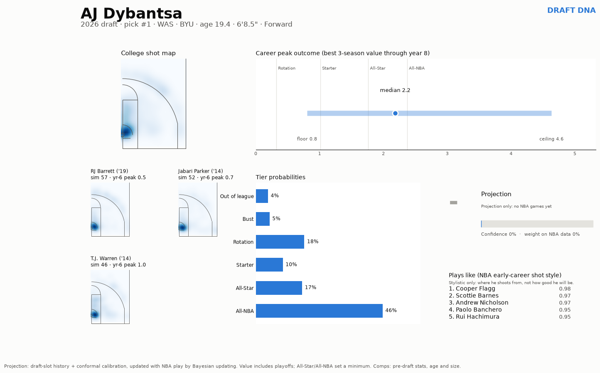

## Method
- **No leakage.** Every forecast for draft class Y is built only from earlier classes and from outcomes observable by Y's draft night (rolling-origin backtests, one fold per draft year). Model choices were made on 2006–2012 and scored once on a 2013–2020 holdout.
- **Baselines first.** Every model was compared to (a) draft-slot history and (b) stats-only comps. When a complex model didn't win, the simpler one shipped.
- **Uncertainty everywhere.** Outputs are ranges and tier probabilities, calibrated with conformal prediction and checked by coverage (target: 25% below floor, 10% above ceiling).
- **Same-point comparisons.** A player with N seasons is compared to his comps' first N seasons, never their full careers.
- **Pre-registration.** The headline shot-data test was written and committed before any model ran ([D027](DECISIONS.md)).
- **Outcome.** Season value = blend of VORP and Win Shares. A career is summarized by its best 3-season stretch, with tiers from Out of league to All-NBA (validated against awards and second-contract pay).

## Findings
1. **Draft position is the forecast to beat, and nothing beat it.** The best stats-based blend tied draft-slot history on the holdout (CRPS 0.331 vs 0.331). Stats-only comps were significantly worse. Calibrated draft-slot history is the model of record: 23.7% of players finished below the floor and 9.8% above the ceiling. ([Phase 3](#phase-3-comps-and-outcome-ranges-from-pre-draft-stats))
2. **Shot data adds nothing detectable.** Adding shot type, assisted rate and shot mix changed forecast error by −0.0001 (95% CI −0.0016 to +0.0013). Shot location and NMF shot styles didn't help either. One exploratory lead, **rim finishing**, is pre-registered for confirmation on the 2023–2026 classes. ([Phase 5](#phase-5-does-how-a-prospect-scores-predict-nba-success))
3. **Who beats their slot?** International and pro-team picks fall short (average PIT 0.40), and no franchise detectably develops players better than slot (p = 0.85, crediting draft-night trades to the team that got the player). Size, passing and FT% predict early overperformance, but for college players that edge fades by year 6. ([Phase 6](#phase-6-who-beats-their-projection-and-why))
4. **Year-4 verdicts hold up 86% of the time**, and when they're wrong they're usually too pessimistic (upgrades outnumber downgrades 3 to 1).
5. **Teams already price in high-school recruiting rank.** Top-10 recruits go about 20 picks earlier than unranked players, then match their slot like everyone else (pre-registered test, ρ = +0.01, p = 0.82). The unranked-to-star list includes Curry, Lillard, Westbrook and Butler. ([Recruiting rank](#recruiting-rank-were-top-recruits-over--or-underrated))
6. **Grades sharpen fast.** Bayesian updating puts about 54% of the weight on observed play after 2 seasons and 79% after 4. Forecast error falls from 0.43 on draft night to 0.03 by year 7. Grades count playoffs and accolades, so a Finals MVP isn't graded on regular-season box scores alone. ([Phase 7](#phase-7-grades-cards-and-the-app))

## Limitations
- **Small n and few folds.** About 1,500 training picks; shot data covers about 415 players. Effects smaller than about 0.5% of forecast error can't be detected.
- **Shot coordinates** exist only from 2014, and mostly for televised high-major games.
- **No international, G League or injury histories.** "Missed games" mixes injury, demotion and coach's decisions.
- **Situation effects are associations**, not causal estimates (E-values reported).
- **Recent players develop less after year 1 than older ones did.** Early floors are pulled toward the peak already reached to compensate ([D034](DECISIONS.md)); on untouched 2015–17 classes about 28% still finish below the year-1/2 floor (target 25%).
- **"Plays like" comps are stylistic only** and say nothing about how good a player will be.

## Quickstart

```bash
make setup      # install environment (requires uv)
make check      # lint, type check, unit tests
make data       # download everything (first run: several hours, rate-limited) and build the database
make models     # backtest models; build projections and comps
make grade      # grades, trajectory bands, plays-like comps, prospect cards
make app        # open the Streamlit app
make refresh    # in-season: re-pull current-season pages, regrade, redraw cards (~3 min)
make dq         # data-quality tests against the built database
```

All raw data is rebuilt from scripts; nothing under `data/` is committed.

**Public app.** The deployed app (Streamlit Community Cloud) has no database. It reads `app/bundle/`, about 11 MB of modeled tables exported by `make bundle`, with no raw source data, and draws cards on demand. It installs only the slim `app/requirements.txt`. During the season, run `make refresh` (which re-exports the bundle), then commit and push `app/bundle/`; the live app redeploys automatically. Every methodological choice is in [DECISIONS.md](DECISIONS.md); status is in [ROADMAP.md](ROADMAP.md).

---

# Detailed results by phase

## Phase 1: Data pipeline

### What's in the database
| | |
|---|---|
| Players | 2,715: 1,833 draft picks (1996–2026, both rounds) plus 882 undrafted players who debuted 1997 or later |
| NBA player-seasons | 12,415 (1997–2026), with playoffs, awards, All-Star selections, games absent, team quality and head coach |
| College player-seasons | 6,992 for 2,214 players, with Barttorvik advanced stats from 2008 and strength of schedule |
| Combine | 1,330 players with measurements and/or athletic tests (2000–2026) |
| Salaries | 12,998 player-seasons, used only to validate the outcome definition in Phase 2 |

Draft classes: **1996–2021** for training and backtesting (1,540 picks), **2022–2025** in progress (233), **2026** live (60).

### Sources
Basketball-Reference (drafts, NBA stats, awards, bios), Sports-Reference College Basketball, Barttorvik (college advanced stats and rim/midrange shot splits), and stats.nba.com through `nba_api` (draft history, combine). Every request goes through one cached, rate-limited fetcher. Sports-Reference is held under its ~20 requests/minute limit, and no page is ever downloaded twice.

### What data exists for each draft class

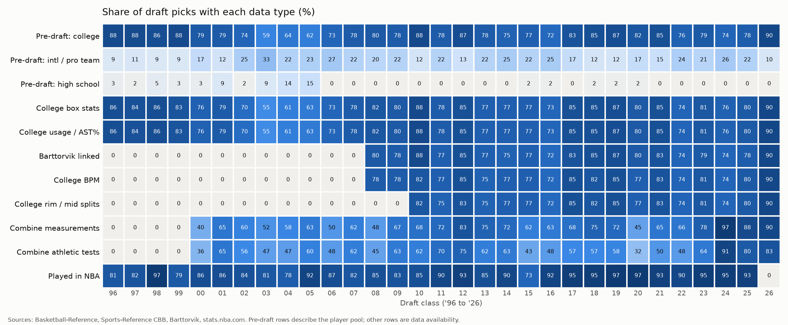

How to read it:
- **College advanced stats depend on era.** Barttorvik (college BPM, adjusted ratings) starts in 2008, and rim/midrange shot splits start in 2010. Usage and assist rate go back to 1996 because they are derived from box-score totals where Sports-Reference doesn't publish them. Derived values match the published ones to within 0.06 points wherever both exist.
- **About 1 in 5 picks didn't play college basketball.** These are international or pro-team prospects (9–33% per class) and, before the 2006 age rule, high-schoolers (up to 15%). They are kept, with a `prospect_source` flag and explicit missing data. Dropping them would remove some of the best outcomes in the sample (Kobe, Garnett, LeBron, Dirk, Giannis).
- **Combine data starts in 2000, and top prospects often skip athletic testing.** Measurements are much better covered than athletic tests.

### Linking players across sources
Each source has its own player IDs, and names don't line up cleanly. The crosswalk anchors on the Basketball-Reference ID and records how every link was made. Problems it handles:
- **Pick numbering:** stats.nba.com and Basketball-Reference number second-round picks differently in 1997, 2001 and 2002. Joining on pick number silently swapped about 85 players (2001 #30 is Trenton Hassell on one site and Gilbert Arenas on the other), so picks are linked by name within each draft year.
- **Name variants:** legal names and nicknames (Barttorvik's "Edrice" Adebayo, "Nah'Shon" Hyland), suffixes (Jr., III), accents, name changes (Metta World Peace, Enes Freedom) and garbled source names ("Ha Ha", "Cui Cui").
- **Same names:** same-name players who debuted the same season (two Tony Mitchells in 2014) are told apart by birth date.
- **Transfers:** Barttorvik assigns a new player ID at each school, so college stats are linked season by season.
- **Post-draft college seasons:** drafted players who later play college ball (James Nnaji: drafted 2023, Baylor 2025–26) have those seasons flagged so they can never leak into pre-draft features.

Match quality is tested against a hand-verified gold set of 62 hard cases, plus coverage thresholds: 98.5% of drafted college players are linked to their college stats, and 99.3% of drafted college players since 2010 are linked to Barttorvik.

### Era adjustment
Counting stats are kept per 100 possessions. Shooting efficiency (TS%) and 3-point attempt rate are stored relative to that season's league average, for both the NBA and Division I. The NCAA 3-point line moved twice (2008–09 and 2019–20) and the NBA's was shortened through 1996–97; both are recorded per season.

### Tests
- **Unit tests (46):** fetcher caching and rate limiting, HTML/CSV parsers, name and school normalization, crosswalk rules, derived-rate formulas.
- **Data-quality tests (17, `make dq`):** draft class sizes, unique keys, cross-source name agreement, ID coverage thresholds, the gold set, no NBA seasons before the draft, flagged post-draft college seasons, award counts, derived-vs-published rates, and null checks.

### Known limits
- No international or G League stats (see DECISIONS D014). Those prospects are modeled on age, size, pick and combine data.
- Opponent-dependent college rates (rebound, steal and block percentage) are unavailable before about 2010 and are not imputed.
- "Games absent" counts every game a player didn't play (injury, rest, coach's decision, G League), not injuries alone.

## Phase 2: What counts as a "better" career?

### Career value
Each NBA season gets a value score: the average of z-scored **VORP** and **Win Shares**, shifted so a season out of the league scores zero. From those season scores, every player gets these outcomes *through N seasons after the draft*:

- **Peak:** best 3-season stretch
- **Total:** sum of all seasons
- **Longevity:** seasons with 500+ minutes
- **Playoffs:** playoff value
- **Career value:** 75% peak + 25% total, scaled against the 1996–2021 draft classes at the same N

Measuring "through N seasons" is what lets a player with 3 seasons be compared fairly to his comps' first 3 seasons.

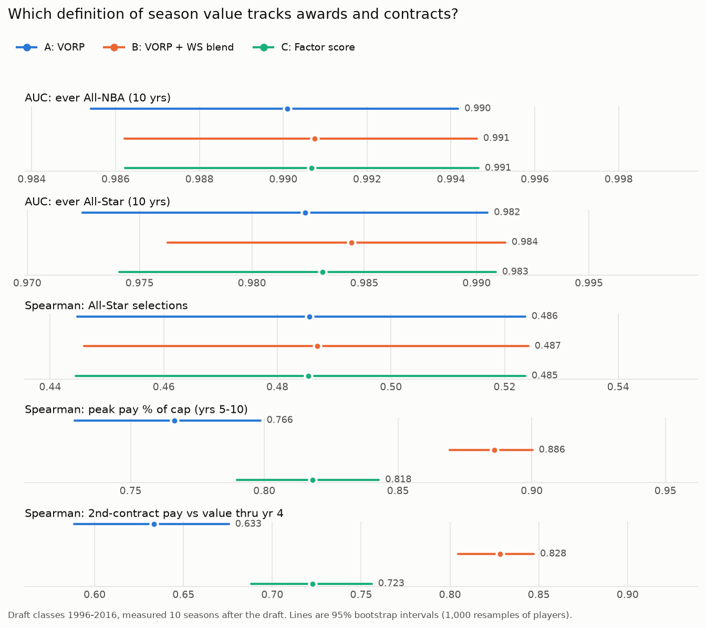

Three definitions of season value were tested against things the metric never sees: All-NBA and All-Star voting, and how much teams paid players on their second contracts. All three predict awards equally well (AUC ≈ 0.98–0.99). The VORP + Win Shares blend tracks contracts much better (Spearman 0.83 vs 0.63 for VORP alone). Plain VORP ranks a below-replacement player who keeps getting minutes *below* someone out of the league, while teams keep paying the former. A data-driven factor score didn't beat the simple blend, so the blend was kept (DECISIONS D016).

### Tiers
| Tier | Best 3-season value | Calibrated to |
|---|---|---|
| Out of league | < 0.01 | no positive NBA value |
| Bust | 0.01–0.32 | in the league, never a rotation player |
| Rotation | 0.32–1.01 | 1,000+ minutes a season |
| Starter | 1.01–1.76 | half the games started, 1,800+ minutes |
| All-Star | 1.76–2.37 | All-Star selection |
| All-NBA | ≥ 2.37 | All-NBA selection |

Tiers describe how a player *played*, not how he was voted (67% exact agreement with the award and role anchors, 97% within one tier). Projections use these six value tiers.

**Finished careers are labeled by what was actually earned** ([D039](DECISIONS.md)):
- **All-Star and All-NBA tiers require the real selection.** Strong numbers alone top out at Starter. This moved 62 players, such as Jason Terry and Tayshaun Prince, who reached All-Star-level value without ever being selected.
- **Three honor tiers sit above All-NBA**, for any player who has earned them:

| Honor tier | Requires | Players |
|---|---|---|
| Superstar | 2+ All-NBA First Team selections | McGrady, Wade, Dwight Howard, Kawhi, Anthony Davis, Tatum, Luka |
| MVP | an MVP award | Iverson, Rose, Westbrook, Harden, Embiid |
| Legend | 2+ MVPs or 10+ All-NBA selections | Kobe, Nash, Duncan, Dirk, LeBron, Chris Paul, Durant, Curry, Giannis, Jokić, SGA |

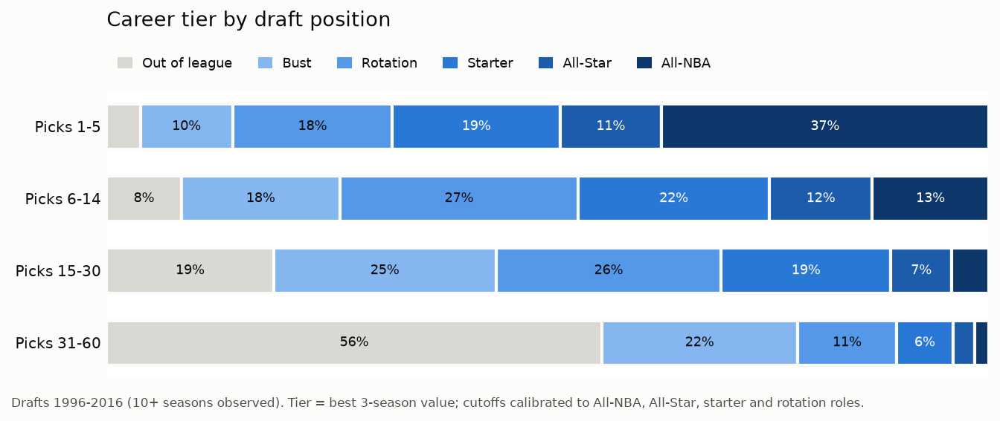

For the 1996–2016 drafts, 37% of top-5 picks reached All-NBA level, versus 13% for picks 6–14 and 4% for picks 15–30. Among second-rounders, 56% never established an NBA career, yet 10% became starters or better.

### Career length (survival analysis)
Many careers from recent drafts are still going, so their length is only a lower bound. Kaplan–Meier curves use those *censored* careers correctly instead of treating them as short.

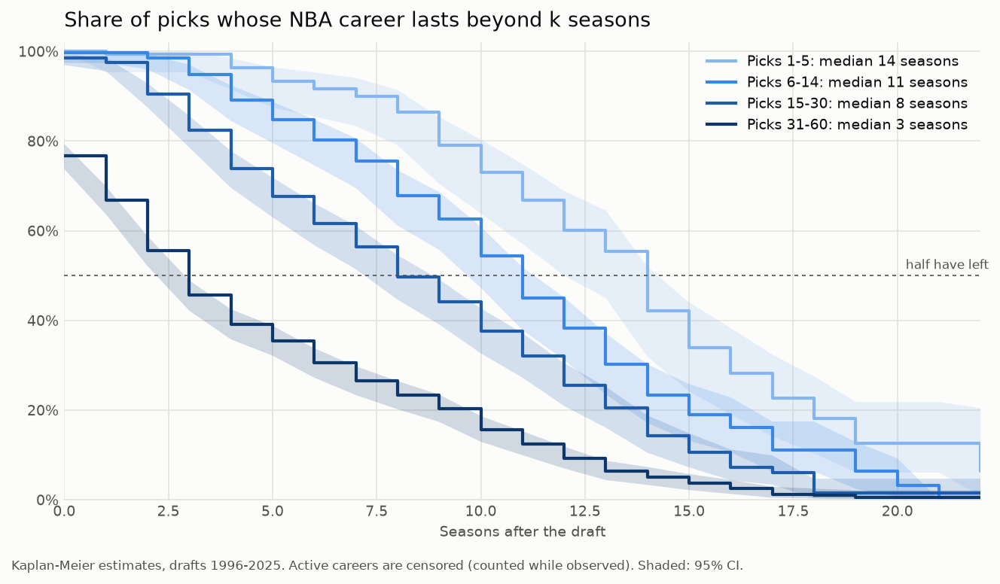

Median career length: 14 seasons for picks 1–5, 11 for 6–14, 8 for 15–30, and 3 for 31–60. A Cox model shows *when* draft position matters. During the rookie deal (seasons 1–4), each doubling of pick number (e.g. #10 → #20) **doubles** the yearly chance of a career ending (hazard ratio 2.07). After season 4 that drops to +16%, and age at draft matters more (+26% per year older). Teams give high picks extra chances early; once players reach their second contract, performance matters far more than draft slot.

### Limits
- The validation targets (awards, peak pay) favor peak performance, so they can't fully settle how much longevity should count. The 75/25 weighting is a judgment call, recorded in D016.
- A career counts as "ended" when the player has missed two straight seasons, so a player on a long injury absence could be misclassified.

## Phase 3: Comps and outcome ranges from pre-draft stats

**Question:** Using only what's known on draft night, can we predict a range of outcomes for each prospect better than draft position alone?

**Setup:**
- **Target:** best 3-season value through year 6, which ranks players almost identically to their career peak.
- **Backtest:** rolling-origin, one fold per draft year. A model for class Y trains only on classes whose 6-year outcomes were complete by draft night of Y.
- **Selection vs. testing:** every modeling choice was made on 2006–2012. The 2013–2020 holdout was scored once.

**Baselines:**
- **(a)** draft-slot history: the outcomes of the 60 historically nearest picks
- **(b)** k-nearest-neighbor comps on standardized pre-draft stats, age and physical profile

**Models tried:**
- LightGBM quantile regression
- NGBoost
- Bayesian hierarchical censored (Tobit) regression with partial pooling by position, era and pick range
- Learned-similarity comps (ridge-weighted and tree-proximity)
- Quantile blends
- Conformal calibration

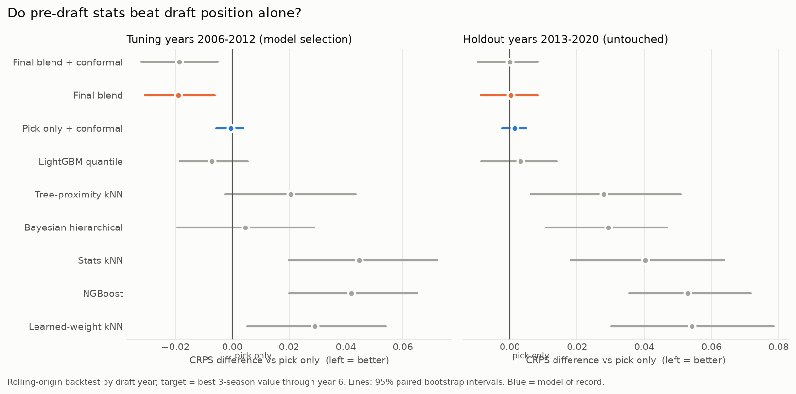

**Finding: pre-draft box-score stats did not beat draft position.**
- On the holdout, the best stats-based model (a blend of pick history, LightGBM and the Bayesian model) tied draft-slot history (CRPS 0.331 vs 0.331; difference CI −0.009 to +0.008).
- On the tuning years the same blend looked 5% better, an illusion the held-out years exposed.
- Stats-only comps were significantly *worse* than draft slot (+0.040).
- Teams' draft order already absorbs what college box scores say. This sets up the headline question for Phases 4–5: does *how* a prospect scores add information that box scores don't?

The model of record is therefore the simplest one: **draft-slot history with conformal calibration.** It is also the best calibrated: on the holdout, 23.7% of players finished below their floor (target 25%) and 9.8% above their ceiling (target 10%).

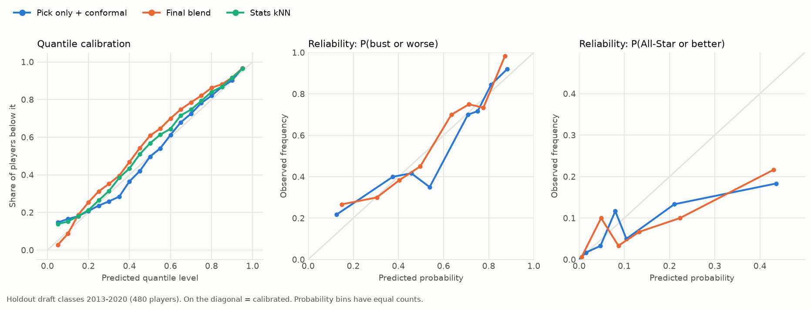

**Where it misses:** for top picks, P(All-Star or better) ran high in 2013–2020. Predictions near 43% came true about 20% of the time.

### Comps
Each prospect gets 15 comps from earlier draft classes, ranked by similarity in pre-draft stats, age and size. Each comp comes with a similarity score and the features that make the two players alike. A first version failed the sanity check: players missing most stats looked similar to everyone. A feature-overlap rule fixed it:

| Prospect | Top comps |
|---|---|
| Kevin Durant | Carmelo Anthony, Paul Pierce, Tim Thomas |
| Anthony Davis | Chris Bosh, LaMarcus Aldridge, Elton Brand |
| Shai Gilgeous-Alexander | Russell Westbrook, John Wall, Derrick Rose, Kyle Lowry |
| Cooper Flagg | Luol Deng, Carmelo Anthony, Thaddeus Young |
| AJ Dybantsa | RJ Barrett, Jabari Parker, Carmelo Anthony |

Comps are context, not the forecast. Stats-only comps are a poor guide to outcomes: Curry's and Lillard's nearest comps mostly flamed out.

### 2026 class
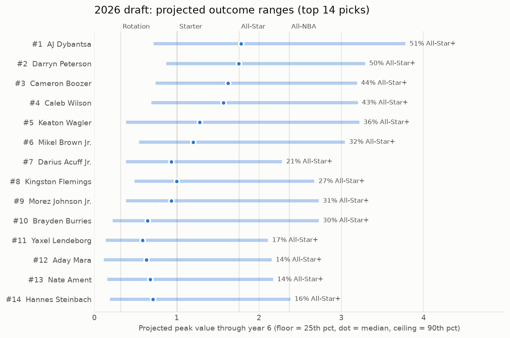

Full tables are in [reports/phase3/phase3_results.md](reports/phase3/phase3_results.md).

## Phase 4: Shot DNA, how each prospect scores

**Audit first.** Before building anything, I sampled 3,148 college games (2008–2026) to see what shot data really exists.

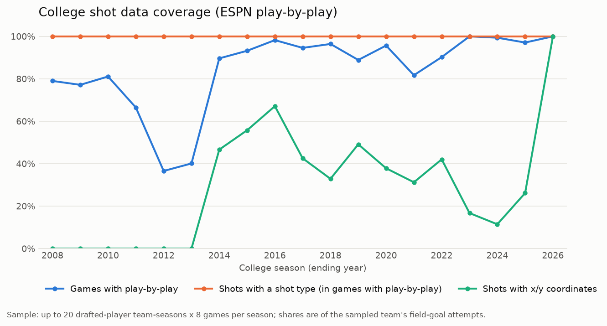

- **Shot type is complete:** every field-goal attempt in ESPN play-by-play is labeled layup, dunk, tip, jumper or three, from 2008 on.
- **Shot location (x/y) is not.** It doesn't exist before 2014. From 2014–2025 only 11–67% of shots have it, mostly from televised high-major games (48% of televised games vs 9% of others). Coverage fell to 11% in 2024, then jumped to 100% in 2025–26.

That shaped a two-tier design:

| Tier | What it measures | Coverage | Used for |
|---|---|---|---|
| A: shot type | rim / midrange / three / dunk mix; shooting by zone (empirical Bayes); assisted vs. self-created makes | 90–100% of drafted college players, 2010+ | Phase 5 headline test |
| B: shot location | 5 court zones; smoothed shot maps; NMF shot styles | 395 players (53–92% of the 2014–2020 classes, 92% of 2026) | player cards, secondary test |

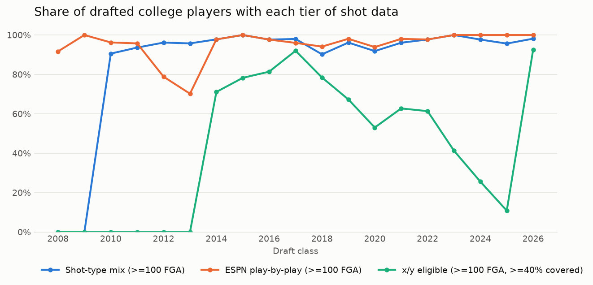

### Six shot styles
Each eligible player's shots become a smoothed heat map. Non-negative matrix factorization then finds six building-block "styles," so every player is a mix of them. Shot distances are rescaled so the 3-point line sits in the same place in every era; otherwise the 2019–20 line change creates a fake "old-line threes" style.

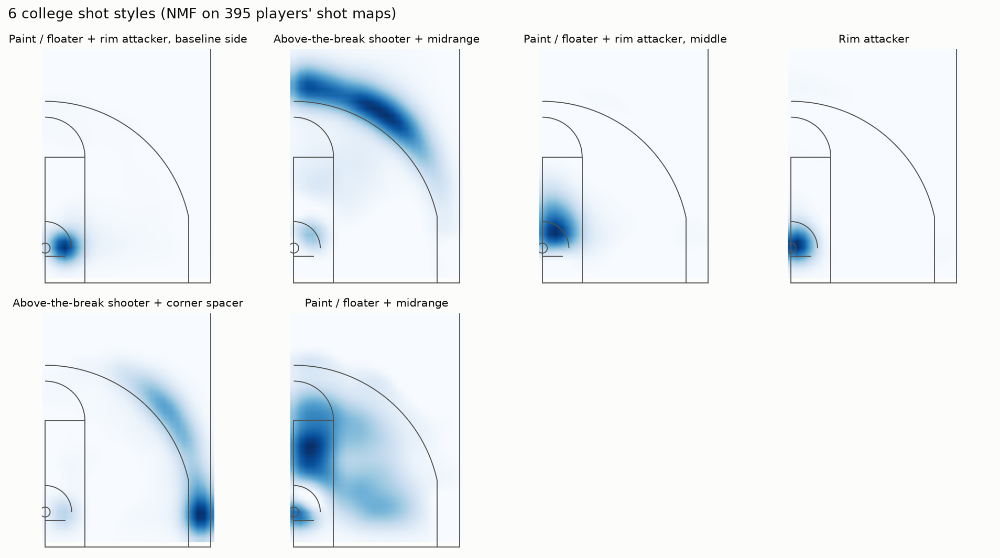

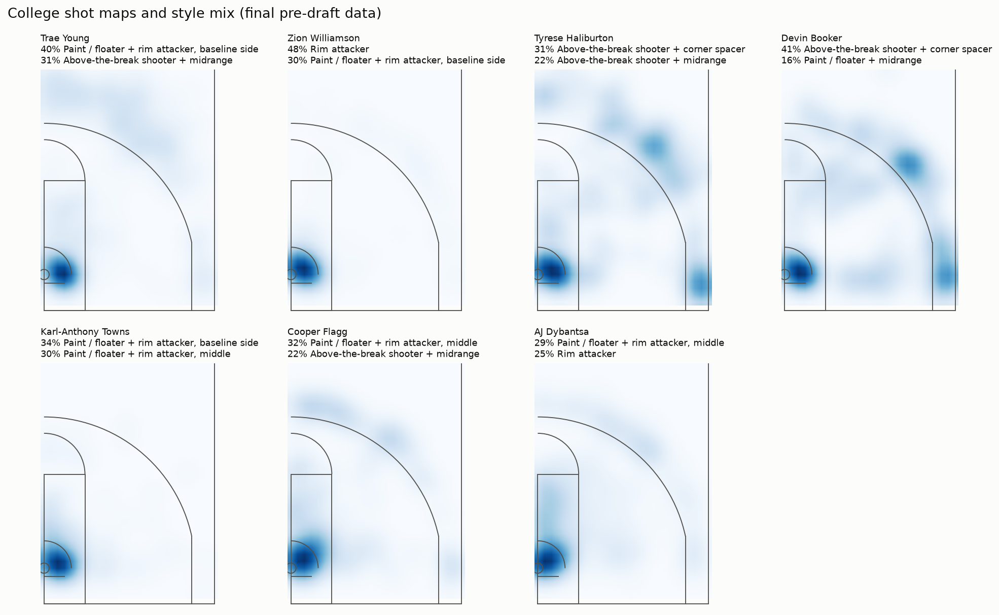

A style mix is a *shape* description, not a shot count. Trae Young's diffuse deep threes carry less weight than his concentrated rim attempts. For "% of shots from X," use the shot-type numbers: Trae took 53% of his shots from three, and only 11% of his rim makes were assisted (versus 49% for Zion).

The test of whether any of this predicts NBA success beyond draft position is Phase 5.

## Phase 5: Does *how* a prospect scores predict NBA success?

**The headline question.** Phase 3 found that college box-score stats don't beat draft position. Does shot data (where and how a prospect scores) add what box scores miss?

**Method.** The full analysis plan was written and committed before any model ran ([DECISIONS D027](DECISIONS.md)).
- **Cohort:** every model sees the same ~415 drafted college players from 2010 on with shot data.
- **Primary design (B):** fully leak-free. Careers are judged at year 4, and a model trains only on classes whose year-4 outcomes were known by draft night.
- **Sensitivity check (A):** year-6 outcomes and more training data, at the cost of using outcomes not yet known on draft night.
- **Models:** stats-only, shot-only and combined versions of both comps and LightGBM, each with and without the draft pick. The comps' stats/shot blend weight was tuned on early years only.

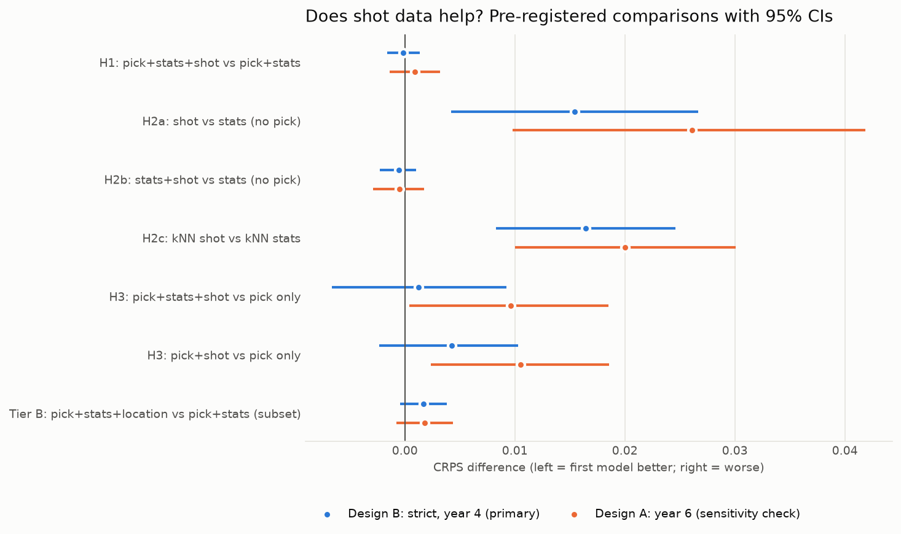

**Finding: no. Shot data added no detectable predictive value, in either design.**
- **Beyond pick + stats:** adding shot type, assisted rate and shot mix changed forecast error by −0.0001 (95% CI −0.0016 to +0.0013). That interval is narrow enough to rule out anything but a tiny effect.
- **On its own:** shot data is a *weaker* signal than box-score stats (+0.015 worse for models, +0.016 for comps). When the comp blend was tuned, it gave shot data zero weight.
- **Shot location:** on the 157–215 players with coordinates, adding zone shares and the six NMF shot styles didn't help either.
- **Subgroups:** none of the 24 position × pick-band subgroups showed a detectable effect.
- **Draft position:** nothing beat it. It remains the model of record.

The most plausible reading: a prospect's shot profile is mostly *downstream* of things box scores and scouts already capture (size, athleticism, role). How much and how efficiently a player scores matters; where the shots come from adds little once those are known.

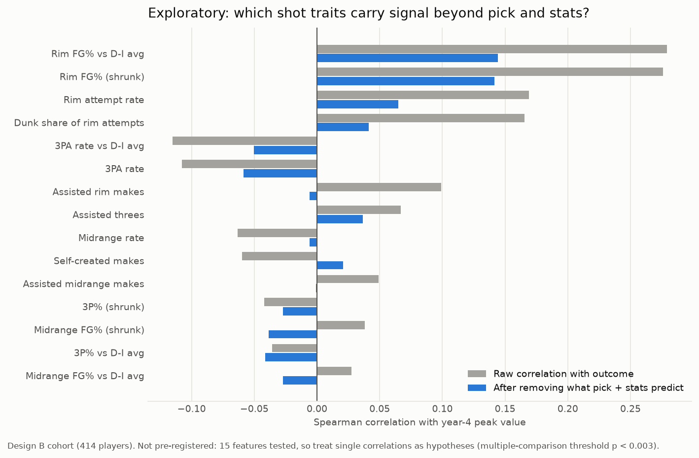

**One lead worth following (exploratory, not confirmed).** Of 15 shot traits, only **rim finishing** (shrunken rim FG% relative to the Division I average) still correlates with outcomes after removing what pick + stats predict (ρ = 0.14, p = 0.0032). That's right at the multiple-testing threshold, so it's a hypothesis, not a finding. A confirmation test is pre-registered ([D029](DECISIONS.md)) on the 2023–2026 classes, which no Phase 5 analysis has touched, to run as their year-4 outcomes arrive.

**Limits:**
- **Sample size:** shot data starts with the 2010 class, so the cohort is ~415 players. Effects smaller than about 0.5% of forecast error can't be detected.
- **Coordinates:** location data covers the 2014+ classes and leans toward televised games.
- **Outcome:** "success" means peak value by year 4 (primary) or year 6 (check). A trait that only pays off late in a career would be missed.

## Phase 6: Who beats their projection, and why

Each player's draft-night projection gives a range. A **PIT score** says where his actual career landed inside it: 0.5 = right at the projected median, 0.9 = beat 90% of the range. The projections are calibrated (average PIT 0.49–0.51), so groups that average well above or below 0.5 systematically beat or miss their draft slot.

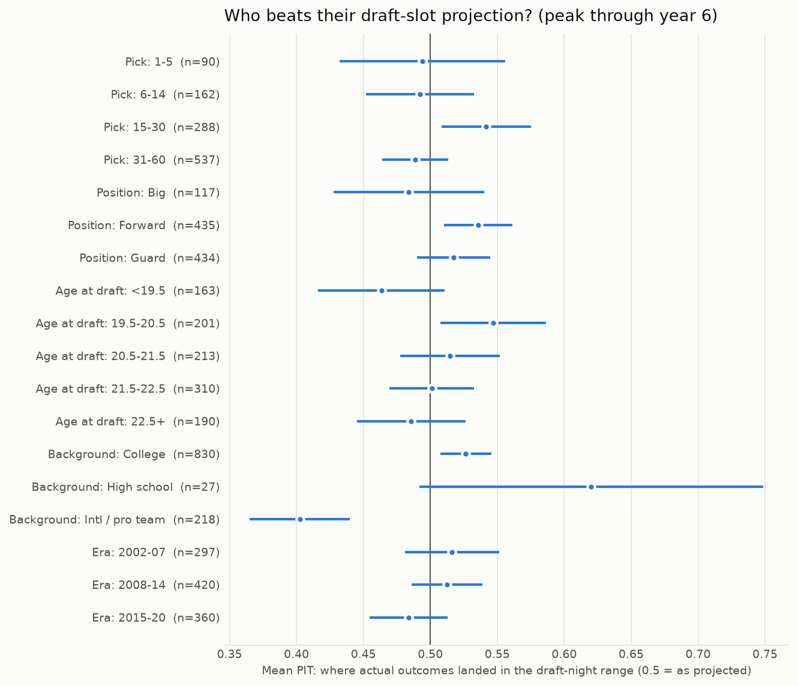

- **International and pro-team picks fall short of their draft slot** (average PIT 0.40). Part of this is stash risk: second-rounders who never come over.
- **Late first-rounders (picks 15–30) slightly beat their slot** (0.54), as do forwards.
- **No trend by era.** Teams draft no better or worse against slot history than in the early 2000s.

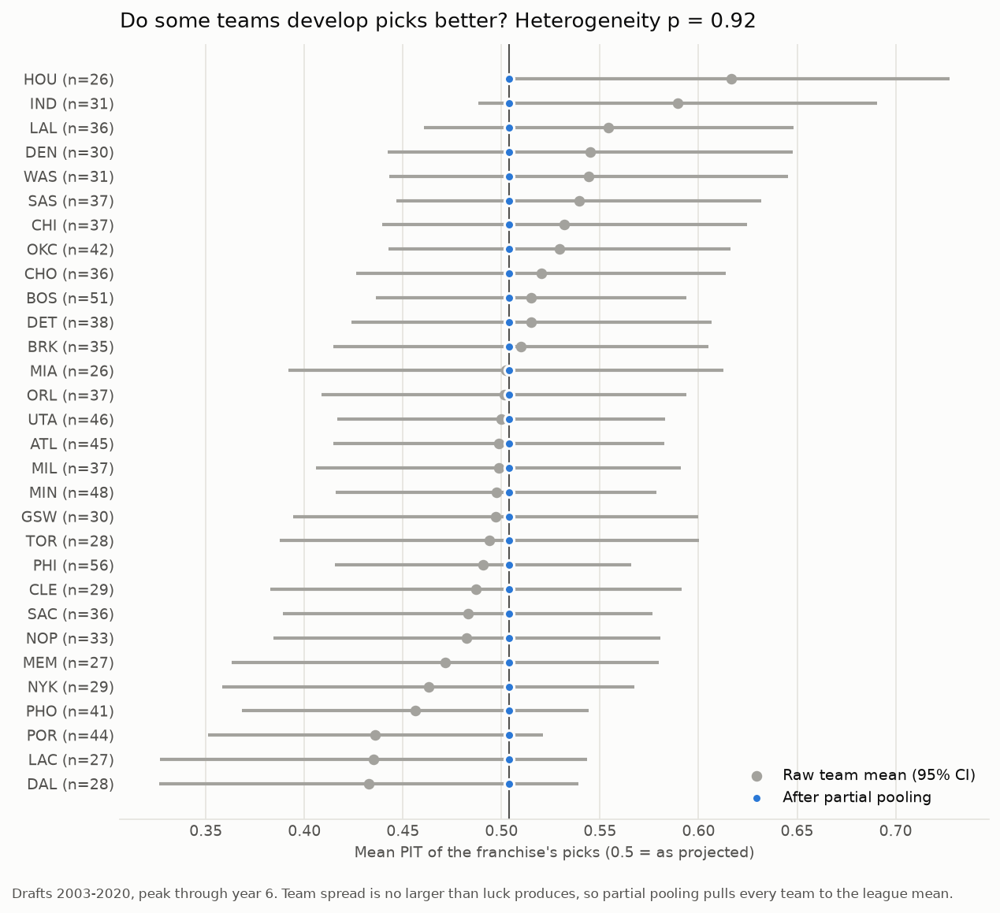

**No team detectably develops its picks better than their draft slot implies.** Franchise differences are no bigger than luck would produce (heterogeneity p = 0.85 at year 6). Picks traded on draft night are credited to the team that acquired them (Shai Gilgeous-Alexander to the Clippers, Luka Dončić to Dallas). Houston's and Indiana's apparent edges disappear under partial pooling.

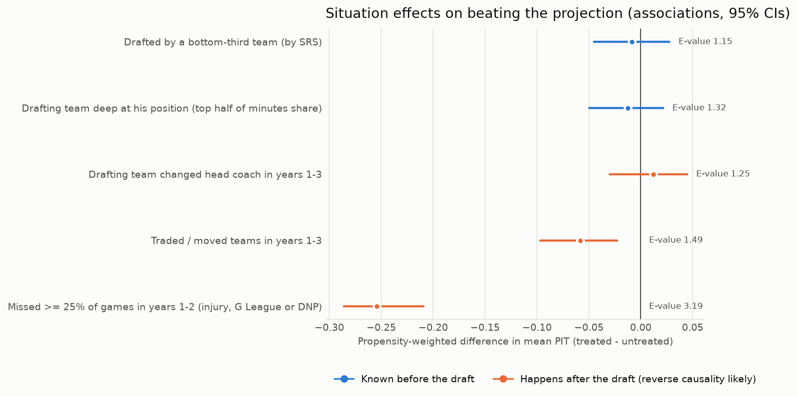

**Situation effects** (propensity weighting adjusts for pick, age, size, stats and background; E-values say how much hidden bias would erase each one):
- **Before the draft:** being drafted by a bad team or onto a crowded depth chart showed no detectable effect. Neither did a coaching change during the rookie deal.
- **After the draft:** being traded in years 1–3 (−0.10) and missing a quarter of games in years 1–2 (−0.25) are strongly associated with falling short. Both are more plausibly *results* of underperforming than causes: struggling players get traded and benched. Draft-night trades don't count as "traded" here. The E-value for trades is 1.9.

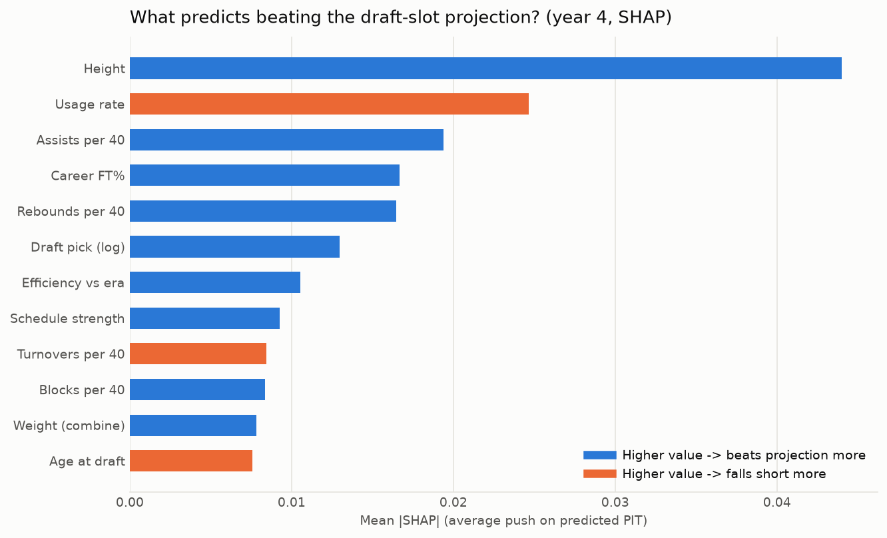

**Some pre-draft traits predict beating the draft slot early.** Size, passing, rebounding and free-throw shooting push players above their projection; high usage and turnovers push them below. One reading: teams overpay for college scoring volume.
- **Strength of the signal:** in a strict test where each class is predicted only from earlier classes, it holds through year 4 (rank correlation 0.19, p < 0.001).
- **Where it fades:** for college players it is gone by year 6 (0.04, p = 0.43). That's consistent with Phases 3 and 5: draft slot catches up.

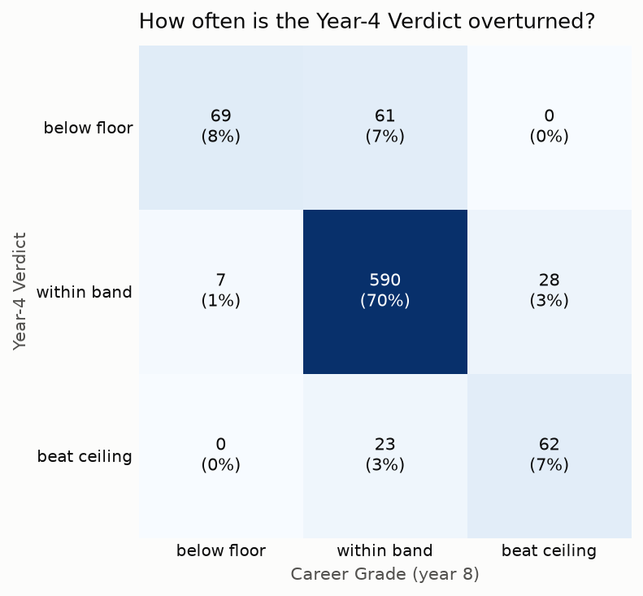

**The Year-4 Verdict holds up 86% of the time.** Of 840 players, 14% changed category between year 4 and year 8, and upgrades outnumbered downgrades 3 to 1.
- **Late bloomers:** Stephen Curry, Shai Gilgeous-Alexander, James Harden, Domantas Sabonis and Derrick White all looked merely "within range" at year 4.
- **Most downgrades weren't collapses.** They were early overachievers who plateaued (Anthony Davis, Paul George, Trae Young) while the projected ceiling for top picks kept rising.
- **True late busts are rare:** 7 players, 0.8%.

**Limits:**
- **Causality:** situation effects are associations under stated assumptions, not causal estimates.
- **Injuries:** there's no public injury history, so "missed games" mixes injury, G League stints and coach's decisions.
- **Multiple comparisons:** segment comparisons span about 17 groups, so treat single borderline intervals as hypotheses.

## Phase 7: Grades, cards and the app

### Grading: from projection to career grade
Every player starts with his draft-night range (the **prior**). Each NBA season is evidence about where his peak will land. A Bayesian update blends the two, giving more weight to observed play as seasons accumulate, and the error model is fit on history. The peak can never fall below what he has already reached.

**What's graded** is the best 3-season stretch through year 8, with two additions to the Phase 2 value ([D033](DECISIONS.md)):
- **Playoffs count.** Each season adds its playoff VORP and Win Shares on the same scale, so deep runs add value.
- **Accolades set a minimum.** All-NBA guarantees at least an All-NBA-tier peak; an All-Star selection or Defensive Player of the Year at least All-Star tier; an All-Defensive team at least Starter tier.

The draft-night projections are refit on this same measure, so the letters stay balanced. The first version graded on regular-season box scores alone and gave Jaylen Brown, a Finals MVP, a C. He is now a B, Jamal Murray goes C→B and Jayson Tatum B→A, while busts like Anthony Bennett and Markelle Fultz stay D.

**Every pick since 1996 is graded.** Classes before 2005 had too few earlier drafts in the data for an honest draft-night projection. They get a *retrospective* projection (how the same draft slots did in other drafts), labeled on the card and never used for calibration or validation. Late-1990s and early-2000s second-rounders washed out more often than later ones, so those classes get more D's (40%).

| Status | Seasons | Data weight (avg) |
|---|---|---|
| Projection | 0 | 0% |
| Provisional (low confidence) | 1 | 34% |
| Provisional (medium confidence) | 2–3 | 54–66% |
| Year-4 Verdict | 4–7 | 79–99% |
| Career Grade | 8+ or retired | final |

**Grade:** where the current median sits in the draft-night range. **A** above the ceiling (90th percentile), **B** above the median, **C** above the floor, **D** below it. On finished careers with an as-of projection, A/B/C/D = 9% / 37% / 29% / 25%.

**Validation** on the held-out 2011–2018 classes (480 players):
- Forecast error (CRPS) falls from 0.428 on draft night to 0.155 after 4 seasons and 0.028 after 7.
- Calibrated ceilings are beaten 7–10% of the time (target 10%).
- Floors: 24–26% of players finish below them in years 1–3 and 28–31% later (target 25%). Recent classes develop less after year 1 than the history the model learns from, so early floors are pulled toward the peak already reached; the factor was tuned on 2011–14 classes, and on the untouched 2015–17 classes the year-1/2 miss rate is 28% (was 35%).

| Player | Status | Grade | Draft-night median | Now (floor – ceiling) |
|---|---|---|---|---|
| Victor Wembanyama | Provisional (medium) | A | 2.16 | 4.99 (4.30 – 7.18) |
| Kon Knueppel | Provisional (low) | B | 1.90 | 4.08 (2.99 – 6.73) |
| Cooper Flagg | Provisional (low) | B | 2.18 | 3.23 (2.28 – 5.63) |
| Paolo Banchero | Year-4 Verdict | B | 2.16 | 2.52 (2.10 – 3.64) |
| Jaylen Brown | Career Grade | B | 1.84 | 2.37 (final) |
| LeBron James | Career Grade (retrospective) | A | 2.16 | 8.04 (final) |

### Prospect cards
Each card shows the prospect's college shot map next to his top-3 comps' maps. It also shows his outcome range against the tier lines, tier probabilities, status, grade and confidence bar, and, for 2022–25 players, his path against the projected band. Samples: [Dybantsa](reports/cards/dybanaj01.png), [Peterson](reports/cards/peterda02.png), [Boozer](reports/cards/boozeca02.png), [Flagg](reports/cards/flaggco01.png), [Wembanyama](reports/cards/wembavi01.png), [Banchero](reports/cards/banchpa01.png).

### "Plays like"
NBA early-career shot maps are projected into the same six college shot styles. Each prospect gets the five nearest NBA players by style mix, within 3 inches of his height. This is a description of shot diet only: Phase 5 showed style doesn't predict success.

### The app
`make app` opens a Streamlit app with eighteen pages:
- **Home:** the headline findings in ten seconds, with links into each page and featured prospects
- **How accurate is it?:** held-out calibration (23.6% below floor, 9.8% above ceiling), every model vs draft slot, how the forecast sharpens by season, and where it misses (All-Star odds for top picks run high)
- **Player card:** pick a draft class or type a name; card, plain-language tier and All-Star odds, comps (click one to open its card) and the whole class
- **Full rankings:** all 1,833 picks ranked by career peak or any other metric, filterable, with CSV download
- **Colleges:** which programs' picks beat their draft slots (Marquette, Villanova, Kentucky lead), with intervals
- **International:** the overseas pipeline by country: who came over, who was stashed, how they did
- **Guess the pick:** see a career, guess the draft slot
- **Redraft:** any class re-ordered by how careers turned out (2011: Kawhi, Butler, Kyrie, Isaiah Thomas from #60), with cross-class columns: *played like a typical #X pick* and *all-time rank*
- **Draft classes:** which drafts were strongest. Each class's total value against an average class from the same picks, split into lottery vs later picks (2003, 2008 and 2009 lead; 2000 and 2016 trail)
- **Steals & busts:** biggest moves between draft slot and redraft position, by year range and round
- **Teams:** each franchise's picks against their slots (no detectable skill, per Phase 6, so read it as history)
- **Recruits:** did teams misjudge high-school recruiting rank? (no), plus unranked stars and top-recruit misses
- **Leaderboards:** rookie-contract bargains (surplus in today's dollars), late bloomers, playoff risers, second contracts vs slot, durability, and draft-night bust risk
- **Pick value:** what each slot is worth (#1 = 100) with a trade calculator
- **Compare:** two players side by side
- **Style map:** about 1,900 college and NBA shot diets, either on readable axes (share of shots at the rim vs from three) or as a t-SNE similarity map, where only closeness between dots matters and the axes have no units
- **2026 tracker:** each rookie's season-value pace against his draft-night range
- **About:** this writeup

The app uses a dark "Apple meets superhero" theme (`.streamlit/config.toml` plus `app/theme.py`): Inter type, frosted-glass panels, a red-to-gold hero gradient, and chart colors checked for colorblind separation and contrast on the dark background. Prospect cards use a matching dark style with glowing shot maps.

Every card has a shareable link (`?player=<id>`), and every page has its own (`?page=redraft&year=2011`).

`make refresh` updates the tracker and every grade during the season.

## Recruiting rank: were top recruits over- or underrated?

**Question.** Given where a player was drafted, does his high-school recruiting rank (RSCI top 100) predict whether he beat or missed his draft slot? If top recruits beat their slot, teams underrated pedigree; if they missed, teams overrated it.

**Method.** The plan was written and committed before any numbers were run ([D035](DECISIONS.md)):
- 809 drafted college players (2005–2021), each with an honest draft-night projection.
- PIT says where each career landed within the range expected for his slot (0.5 = as expected).
- Primary test: does PIT trend with recruit rank at year 4? Year 8 and first-round-only are robustness checks.

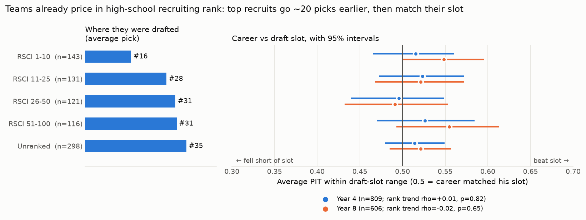

**Finding: no.** There's no trend at year 4 (ρ = +0.01, p = 0.82) or year 8 (ρ = −0.02, p = 0.65), and no recruit group differs from its slot. The left panel shows why: teams already used recruiting rank when picking. Top-10 recruits went around #16 on average, unranked players around #35. Once that's priced in, pedigree says nothing more. This matches Phase 3, where adding recruiting rank to the model didn't beat draft position.

**Limits.** RSCI only ranks the top 100, so "unranked" lumps near-misses together with complete unknowns. Results by group are in [reports/recruits/results.md](reports/recruits/results.md), and the app's Recruits page lists the biggest unranked successes and top-recruit misses.

